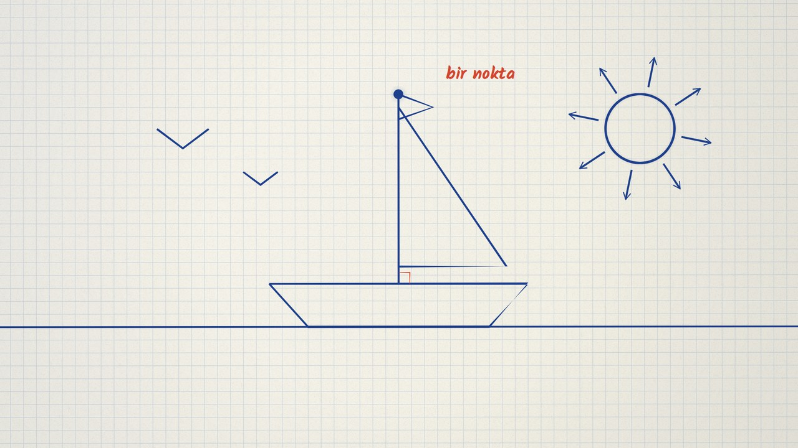
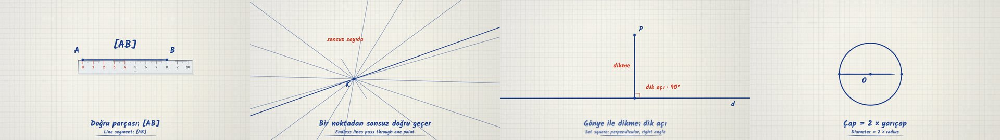

# Noktadan Çembere · From a Point to a Circle

**▶ Tarayıcıda izleyin / Watch in the browser:** https://hakanatas.github.io/noktadan-cembere/ 
**⬇ MP4 + altyazılar / MP4 + subtitles:** [Releases](https://github.com/hakanatas/noktadan-cembere/releases) 
**✎ Kullanılan istem / The prompt behind it:** [PROMPT.md](PROMPT.md)

> **TR —** 5. sınıf matematik "Geometrik Şekiller" temasının ilk öğrenme çıktılarına (MAT.5.3.1–5.3.2) göre hazırlanmış, tamamen JavaScript ile çizilen 100 saniyelik bir animasyon. Kareli defterde; nokta, doğru parçası, ışın, doğru, açı, dikme ve çemberi cetvel, gönye ve pergelle adım adım çiziyor. Sonunda bunların hepsinden tek bir resim çıkıyor. Altyazılar Türkçe, İngilizce ya da ikisi birlikte seçilebilir; `.srt` dosyaları ve seslendirme notları da ekli.

A 100-second procedural animation for **5th-grade mathematics**, drawn entirely with JavaScript on an HTML5 canvas. It covers the basic geometric drawings of the Türkiye Yüzyılı Maarif Modeli *Geometrik Şekiller* theme.

The look is a squared school notebook: blue fountain-pen lines for the drawings, and a red pencil for names, measurements and highlights. The four drawing tools of the curriculum (pencil, ruler, set square, compass) do the drawing on screen. Captions are in Turkish, English, or both.

## Öğrenme çıktıları / Learning outcomes

Source: MEB, *Ortaokul Matematik Dersi Öğretim Programı*, 5th grade, theme "Geometrik Şekiller" (content framework: *Temel Geometrik Çizimler ve İnşalar, Açı Ölçme, Çokgenler ve Çember*). This animation covers the first two outcomes of the theme.

**MAT.5.3.1. Temel geometrik çizimler için matematiksel araç ve teknolojiden yararlanabilme**
- a) Nokta, doğru, doğru parçası, ışın, açı, çember ve dikme çiziminde gerekli araç ve teknolojileri tanır.
- b) … oluşturmak için uygun olan araç ve teknolojileri belirler.
- c) … oluşturmak için uygun araç ve teknolojileri kullanır.

**MAT.5.3.2. Temel geometrik çizimlere dayalı deneyimlerini yansıtabilme**
- a) Temel geometrik çizimlere dayalı deneyimlerini gözden geçirir.
- b) Temel geometrik çizimlerin özelliklerine yönelik çıkarım yapar.
- c) Çıkarımını farklı örnekler üzerinden değerlendirir.

> In the program the theme's codes are MAT.5.3.x. Some schools teach this theme first in their yearly plan.

## Scenes → outcomes

| # | Time | Scene | What happens | Outcome |
|---|---|---|---|---|
| 1 | 0–11 s | **Nokta** | The pencil taps the paper and leaves a point. The camera zooms in 10×: the grid grows but the point stays the same size, because a point has no size. Points are named with capital letters (A, B, C…). | 5.3.1 a–c · 5.3.2 b |
| 2 | 11–27 s | **Doğru parçası** | Many curved lines can join A and B, but the straight one is drawn with a ruler. It is written [AB], it has two endpoints, and its length is measured from the 0 mark: 8 cm. | 5.3.1 b–c · 5.3.2 b |
| 3 | 27–40 s | **Işın** | The pencil keeps going past B. The camera and the ruler chase it, but it never ends. It is written [AB, starts at A, and cannot be measured. | 5.3.1 c · 5.3.2 b–c |
| 4 | 40–54 s | **Doğru** | The line goes on forever in both directions: AB with ↔ above it, or "line d". Experiment: countless lines pass through point K, but only one line passes through both K and L. | 5.3.1 c · 5.3.2 b–c |
| 5 | 54–70 s | **Açı ve dikme** | Two rays that start at the same point make an angle ABC. Its vertex is B and its arms are [BA and [BC. Turning one arm opens and closes the angle. Then a set square slides along line d and a perpendicular is drawn from P, making a right angle (90°). | 5.3.1 a–c · 5.3.2 b |
| 6 | 70–86 s | **Çember** | The compass hops in, puts its needle on the centre O, is opened to 3 cm on the ruler, and turns once. Eight 3 cm radii show that every point is the same distance from O. The diameter is 6 cm, twice the radius. | 5.3.1 a–c · 5.3.2 b–c |
| 7 | 86–100 s | **Hangi araç?** | Each tool is matched with what it draws: ruler → segment, ray, line; set square → perpendicular; compass → circle. Then all the drawings come together as one sailboat picture: sea = line, hull = segments, mast ⊥ deck, sun = circle, sunbeams = rays, gulls = angles. It all began with a point. | 5.3.1 b · 5.3.2 a, c |

Notation follows Turkish textbook conventions: segment [AB], ray [AB, line AB with a ↔ above it, angle ABC (vertex in the middle), length |AB|, circle with centre O and radius r.

## Running it

- **Preview:** double-click `index.html`. It needs no server and no internet. Controls: play/pause (Space), timeline with scene markers, speed ¼×–2×, 16:9 or 9:16 format, captions Off / TR / EN / TR+EN.
- **MP4:** run `npm install` once, then `npm run export -- --format=horizontal --captions=tr`. Options: `--format=vertical|both`, `--captions=off|tr|en|bi`. Rendering is deterministic, frame by frame (Playwright + FFmpeg), and writes an `.srt` file next to each video.
- **Subtitles and narration:** `npm run srt` writes `out/captions_*.srt` and `narration_notes.txt`, a suggested voice-over line for each caption.
- **Single file:** `npm run bundle` creates `dist/noktadan-cembere.html`.

## Editing

- `captions.js`: caption text, timing, and narration notes.
- `scenes/scene1.js` … `scene7.js`: one module per scene.
- `src/draw/geo.js`: the drawing kit (pen line, point, label, arrow, right-angle mark, angle arc, measurement line, and the pencil, ruler, set square and compass).
- `src/ink/paper.js`: notebook paper. Grid squares are 5 mm, and 60 world units = 1 cm.

The engine comes from *The Learning Ink* (github.com/hakanatas/the-learning-ink): a master timeline, `renderFrame(t)` as a pure function of time, and seeded randomness.
